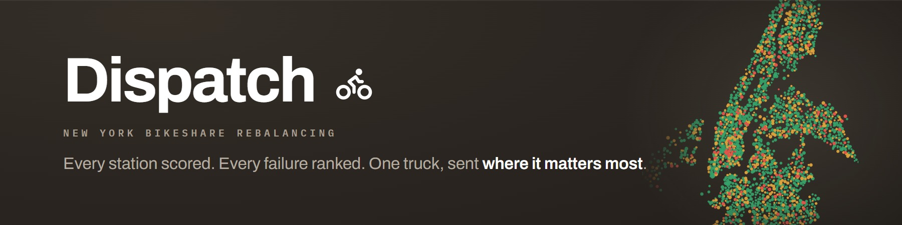
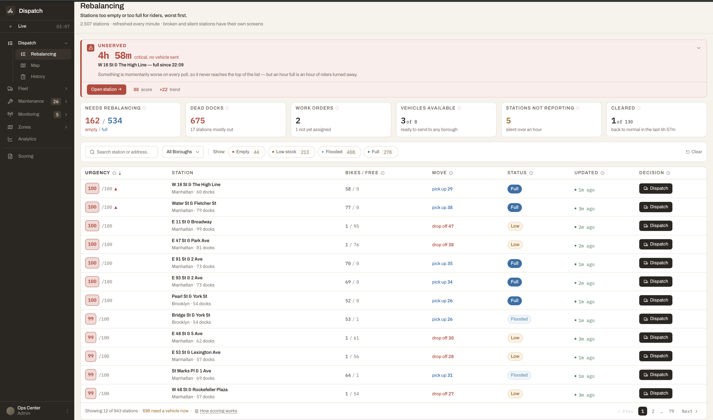
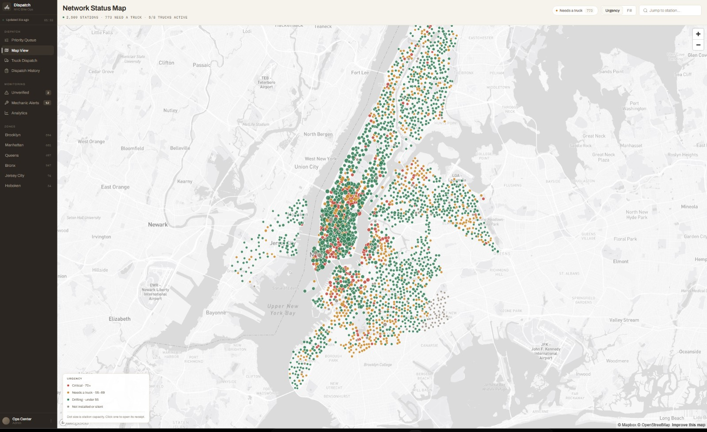

[](https://github.com/NICOCODIGO/Dispatch-NYC-bike)

<a href="https://github.com/NICOCODIGO/Dispatch-NYC-bike" target="_blank" rel="noopener">
  
</a>

**A live dashboard that reads New York's public bike-share data and answers one question: which station should a truck go to next, and should it be dropping bikes off or picking them up?**

---

## The problem

Bike-share only works if there's a bike where you are and an empty dock where
you're going. Both fail constantly, and for the same reason: **riders decide
where the bikes go.**

Every weekday morning, thousands of people ride *out* of residential
neighbourhoods and *into* business districts. By 10am, uptown racks are empty
and midtown racks are jammed solid. Two different people are now stuck:

- You want a bike. The dock is **empty**. You walk.
- You want to park. The dock is **full**. You ride around hunting for space,
  and you're late.

The fix is unglamorous — a van drives around moving bikes from where they piled
up to where they ran out. The industry calls it **rebalancing**.

The hard part isn't the driving. It's deciding **where to drive.** New York has
**2,509 stations**, and on a normal afternoon somewhere between **700 and 800 of
them** need attention at the same time. However many trucks an operator runs,
it is never 750.

So the real job is triage: *of the 750 things going wrong, which twenty matter
most right now?* That's the question this dashboard exists to answer.

---

## The data: what GBFS is

Every major bike-share system in the world publishes its live status publicly,
in a shared format called **GBFS** — the *General Bikeshare Feed Specification*.
It's the reason your maps app can show you Citi Bike docks without Citi Bike
building anything for it.

It's just a set of files on the internet, refreshed every few seconds. Anyone can
read them. No key, no login, no permission.

If you've ever opened the map on citibikenyc.com and tapped a station to see how
many bikes are left — **that's this data.** Same source, same numbers, right down
to the Site ID printed at the bottom of their popup. The difference is what gets
done with it: their map answers *"can I get a bike here?"* for one rider. This
one tries to answer *"where do I send the truck?"* for the whole city at once.

For each station, the feed tells you roughly this:

```json
{
  "station_id": "66dc7f02-0aca-11e7-82f6-3863bb44ef7c",
  "name": "Park Ave & E 41 St",
  "lat": 40.751581,
  "lon": -73.97791,
  "capacity": 109,
  "num_bikes_available": 0,
  "num_docks_available": 109,
  "last_reported": 1755374820
}
```

That's the whole thing. Multiply by 2,509.

**And that's the problem.** The feed is scrupulously factual and completely
mute on the only thing that matters. It will tell you a station has zero bikes.
It will not tell you whether that's a crisis or a Tuesday. Nothing in it says
*urgent*, *ignore this*, *this one has been broken for six hours*, or **go here
first**.

It's a spreadsheet with 2,509 rows and no sort order.

---

## What this app does with it

Dispatch reads that feed every minute and turns each station into something a
person can act on. The row above becomes:

> **88** &nbsp; **Park Ave & E 41 St** — Manhattan · 109 docks, all of them empty
> *Nobody can rent here.* → **drop 55 bikes**

Same data. Now it's a decision.

Four things happen to get there:

**1. Name the failure.** Zero bikes and zero docks are opposite emergencies that
need opposite trucks — one needs bikes delivered, the other needs them taken
away. The feed treats both as just numbers. The app separates them, and colours
them differently everywhere: warm means *nobody can rent*, cool means *nobody can
return*.

**2. Score how much it matters, 0 to 100.** Higher is worse. A big station
failing strands more riders than a small one, so size counts. A reading from
40 minutes ago is less trustworthy than one from 40 seconds ago, so freshness
counts. A station that's been broken for hours is worse than one that just
tipped over, so *duration* counts.

**3. Draw a line.** At **55 or above**, the board says send a truck. Below that,
a station is drifting but still serving people on both sides. Above **70** it's
critical and jumps the queue.

**4. Show its work.** Every score opens into a receipt showing the arithmetic —
every number that fed in, and where each one came from. There's a "scoring
method" page listing every constant in the model, each tagged **measured**,
**reasoned**, or **guess**.

That last part matters more than it sounds. A dashboard that hands you a
confident number you can't interrogate is asking to be either obeyed blindly or
ignored. This one tells you, unprompted, that the 55 line is a guess nobody has
validated yet — and that with ~750 stations qualifying against a fleet that can
finish maybe sixteen truckloads a shift, the threshold isn't even the thing
limiting you. **Capacity is.** Moving the line changes the number you report,
not the work that gets done.

---

## Where the data lies to you

Public data always sounds cleaner than it is. Every item below is something that
only showed up by reading the actual live numbers and comparing them to reality
— none of it is written down in the official documentation.

- **Some stations say they last reported in 1970.** 91 of them have no real
  timestamp. A few publish a placeholder date that's meant to mean *"never
  reported"*, but if you take it literally it reads as decades old. Those
  stations then shoot to the top of the list looking like emergencies when
  really nobody has heard from them at all.

- **Stations disagree with themselves.** 706 of the 2,509 report a bike count
  and a dock count that don't add up to the size they claim to be. A station
  might say it holds 73 bikes, then report 11 bikes and 56 free docks — which is
  67, not 73. So "how full is this?" gets measured against the slots actually
  working, not the number on the label. Otherwise a station that's physically
  packed shows up as half empty.

- **The feed doesn't know what a borough is.** There's no borough field at all —
  just a few vague regions and some leftover test entries. Every station's
  borough here is worked out from its map coordinates.

- **A truck can't fix everything.** Some stations aren't out of bikes, they're
  *broken* — switched off, or the dock itself has failed. Driving a van full of
  bikes there accomplishes nothing. Those get routed to a separate maintenance
  list instead of clogging up the dispatch queue.

- **A dead battery still counts as a bike.** This one can't be fixed from this
  data at all. The feed says how many e-bikes are at a station, but not how much
  charge they have. Citi Bike's own app will tell you a station has five e-bikes
  with 33, 16, 11, 2 and 2 miles of range left — two of those are basically
  unusable. This dashboard counts all five as available bikes. So the board can
  say a station is fine when a rider walking up would disagree.

### One more thing worth being clear about

This covers **Citi Bike only.** It doesn't include private rental shops, and it
doesn't include the dockless scooter and bike companies — those aren't in this
feed and never will be. Citi Bike also doesn't serve Staten Island at all.

The 2,509 stations break down as Brooklyn 894, Manhattan 681, Queens 457,
Bronx 367, Jersey City 76, Hoboken 34 — so two of the six areas aren't even in
New York.

---

## The screens

| Screen | What it does | Status |
| --- | --- | --- |
| **Priority Queue** | The ranked board. Every station worth a truck, worst first, with filters and a receipt behind every score. | Live data |
| **Map View** | All 2,509 stations on real geography, coloured by urgency or by fill. | Live data |
| **Scoring method** | Every constant in the model, tagged by how much it's actually worth trusting. | Live data |
| **Fleet Operations** | Trucks grouped by when each frees up, each matched to a suggested job. | Real logic, invented trucks |
| **Dispatch History** | Did the trips we sent actually fix anything? | Works, but resets on reload |
| **Unverified / Maintenance** | Silent stations and mechanically broken ones. | Partly built |
| **Analytics / Zones** | — | Barely started |

---

## The whole network at once



Every station Citi Bike runs, live. Red is critical, amber needs a truck, green
is fine, grey isn't installed yet. Dot size is how many docks the station has, so
a big failure looks big. Click any one of them to open its receipt.

You can also flip the colouring to show *which way* each station is failing —
warm for out of bikes, cool for out of docks. Do that and the daily tide is
obvious at a glance: uptown drains, downtown clogs.

---

## Where this actually stands

**Real and working:**
- Live GBFS polling, all 2,509 stations, refreshed every minute
- The full scoring model, with 161 automated tests pinning its arithmetic
- The ranked queue, filters, search, and the score receipts
- The map, on real coordinates
- Composing and sending a dispatch, then measuring whether the station recovered

**Simulated:**
- **The trucks.** There are 8 of them with positions, loads and schedules, and
  all of it is invented — the public feed contains no vehicles, because no
  operator publishes them. The *matching logic* is real; the vehicles it matches
  are not.

**Not built yet:**
- Analytics and Zones are stubs
- Nothing persists — dispositions, assignments and dispatch history all reset
  when you reload
- 14 buttons across the app are **deliberately disabled**, each with a tooltip
  saying what it would have done. They're switched off rather than left silently
  broken, because a button that does nothing makes you doubt the parts that work.

---

## Running it

```bash
npm install
npm run dev        # http://localhost:5173
npm test           # 161 tests
npm run build      # static site in dist/
```

No backend and no API key needed for the data — GBFS is public and the browser
reads it directly.

**The map is the one exception.** It needs a free Mapbox token:

```bash
cp .env.example .env
# then add:  VITE_MAPBOX_TOKEN=pk.your_token_here
```

Without one, the map falls back to a simple schematic view and tells you why.
If you do add a token, set URL restrictions on it in the Mapbox dashboard —
it ships inside the built JavaScript, as any browser-based map key must.

---

## Built with

React · TypeScript · Vite · Tailwind · Zustand · Mapbox GL

The scoring model lives in one file with no UI dependencies
([`src/model/score.ts`](src/model/score.ts)), so a scheduled background job can
import the exact same logic. That's deliberate: the history and the live board
can never disagree about what a score means.

---

*Station data comes from the operator's public GBFS feed. This is an independent
project — not affiliated with, endorsed by, or connected to Citi Bike, Lyft, or
the NYC Department of Transportation.*
