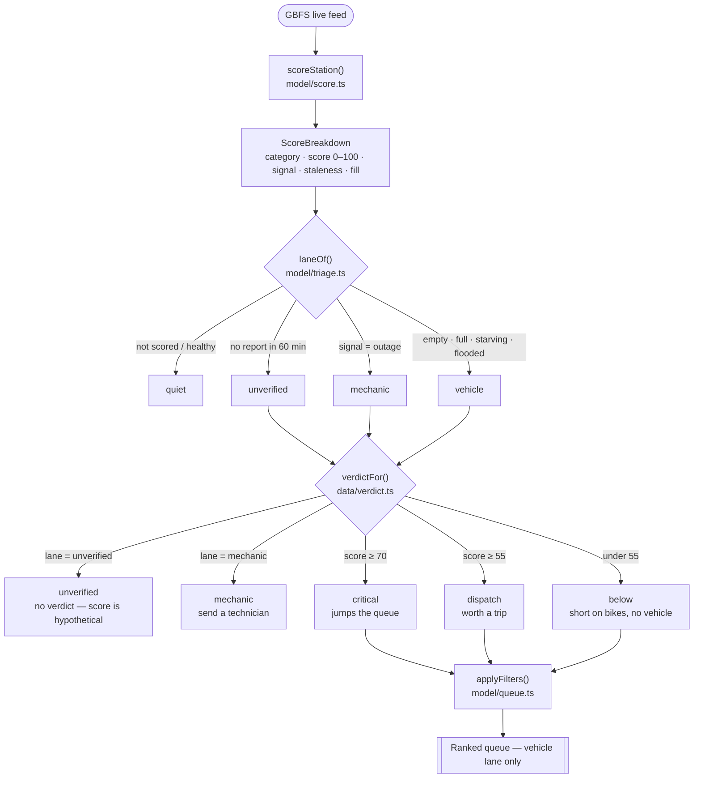
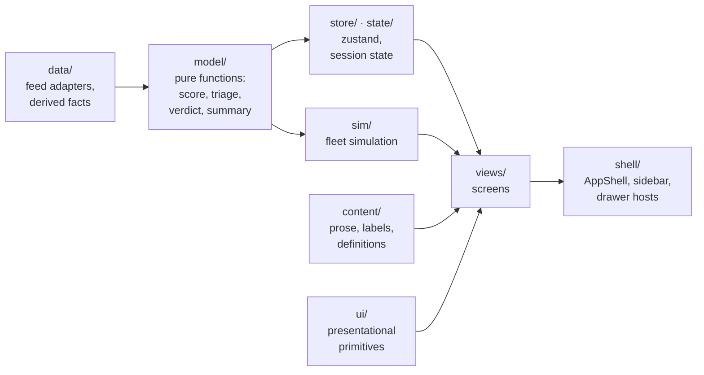

# Architecture

Two diagrams. The first is the one that matters — it is the answer to every
"wait, isn't X the same as Y" question this codebase produces.

Regenerate only when the domain rules change, which should be rare and
deliberate. If you move files around, the second diagram goes stale first.

---

## Decision flow — what happens to one station

A station is scored, then routed, then judged. Three separate steps, in that
order, each owned by exactly one file. Nothing downstream modifies the score.

**Read the `below` node.** That is a station genuinely short on bikes that does
not get a vehicle. "Short on bikes" is a *category*; "needs a vehicle" is a
*verdict*. They are different questions and the diagram is where that stops
being confusing.

Two ordering rules the diagram encodes:

- **Staleness outranks everything in `laneOf`.** An "unusable" reading is
  derived from counts, so untrusted counts mean an untrusted verdict.
- **`verdictFor` checks lane before score.** Otherwise a stale station computes
  a high score off old counts and renders a big red number above the words
  "no vehicle needed yet".

---

## Layering

Strict one-directional. Nothing below reaches up.

`model/` is pure — no React, no fetching, no implicit clock. That is why it is
the only layer with real test coverage and the safe place to work.
